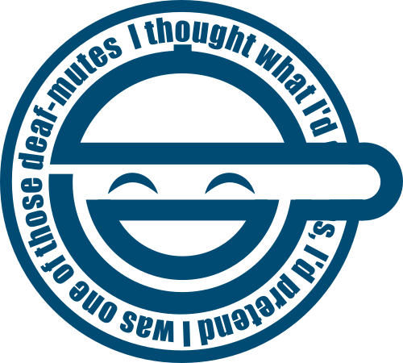

Laughing Man Logo
=================

Back in 2006 I created a trace of the Laughing Man Logo from the
Anime "Ghost In The Shell - Stand Alone Complex 1st Gig". As the SVG and
PNGs I released back then were a lot reused, I decided to rerelease
my original files with some improvements.

I am not the designer of the Logo, the Logo was designed by Paul Nicholson
of Terratag and used by Production I.G. in the anime.

You will find following SVGs here:

- **laughing_man.svg** contains the refined 2018 version of the Logo I traced
back in 2006.

- **other/laughing_man_with_text.svg** contains the (mostly) original SVG
I created 2006. It still contains the text path that was layed down
a circular path.

- **other/laughing_man_masked_text_path.svg** contains a version, where the
text was converted into a path object for easier manipulation. There
are still the primitive masking rectangles over the blue circles and
text however, which make exporting hard.

- **other/laughing_man_inkscape.svg** contains the refined 2018 version of
my Logo trace, with proper boolean operations and a few transparent characters.

The PNG files are what you may use for any rasterized stuff you may
want to do.

Here is the SVG:

